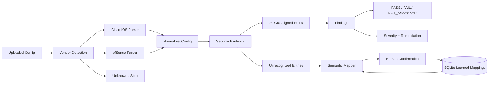

# SIH26155 | Network Security Compliance Auditor

> **AI-assisted, vendor-agnostic network configuration auditing - built for Smart India Hackathon 2026.**

[](#)
[](#)
[](#)
[](#)
[](#)
[](#)

**Team:** TrailBlazers  
**Problem Statement:** SIH26155 - Network Security Compliance Auditor  
**Category:** Software  
**Theme:** Blockchain & Cybersecurity

---

## 1. Why this exists

A network configuration can look compliant while still containing hidden weaknesses: insecure management protocols, missing hardening controls, overly broad firewall rules, or rule-ordering conflicts that prevent a later security rule from ever taking effect.

Manual review is slow, syntax differs between vendors, and a reviewer needs more than a red/green result - they need **evidence, severity, and an actionable fix**.

**Network Security Compliance Auditor** turns a raw configuration file into a traceable security assessment:

```text
Config File
    |
    v
Vendor Detection
    |
    v
Vendor Parser
    |
    v
Vendor-Neutral Normalization
    |
    v
Deterministic Compliance Engine
    |
    +-----------------------------+
    |                             |
    v                             v
PASS / FAIL / NOT_ASSESSED    Evidence + Remediation
```

---

## 2. What the current MVP does

| Capability | Current status | Notes |
|---|:---:|---|
| Single-file configuration upload | ✅ | File size / text validation included |
| Cisco IOS detection | ✅ | Evidence-based deterministic fingerprinting |
| pfSense detection | ✅ | XML-structure-based detection |
| Unknown-vendor handling | ✅ | Unsupported input is not force-classified |
| Vendor-neutral normalization | ✅ | Common Pydantic data model |
| CIS-aligned control themes | ✅ | 20 internal control themes |
| Deterministic compliance | ✅ | `PASS`, `FAIL`, `NOT_ASSESSED` |
| Evidence-backed findings | ✅ | Evidence and expected state returned |
| Severity + remediation | ✅ | Ready-to-copy recommendations |
| End-to-end audit API | ✅ | `POST /api/audit` |
| Semantic learning foundation | ✅ | Sentence Transformers + labeled seed corpus |
| Human-confirmed mapping persistence | ✅ | SQLite |
| Shadow-rule engine | ✅ | Present in the merged implementation |
| PDF reporting | ✅ | Report generator present in the merged implementation |
| Full polished findings UI | 🚧 | Continue validating against the merged frontend |
| Blockchain / tamper-evident ledger | ⏳ | Deferred |
| FortiGate / NIST / bulk inventory | ⏳ | Deferred |

> **Documentation rule:** implemented behavior is described above; deferred items are not presented as active MVP functionality.

---

## 3. Core design principle

### Deterministic evidence first. AI assists mapping.

The compliance engine does **not** ask an AI model whether a control passed.

Instead:

```text
Configuration
    |
    +--> deterministic parser --> evidence
    |
    +--> unrecognized line --> semantic suggestion
                                  |
                                  v
                           human confirmation
                                  |
                                  v
                              SQLite
```

The AI layer can suggest mappings for previously unrecognized configuration lines. A human confirms the mapping before it becomes learned state.

This separation makes the assessment explainable:

- **Parser:** extracts facts.
- **Normalizer:** converts vendor syntax into a common model.
- **Compliance engine:** decides status from explicit evidence.
- **AI layer:** suggests semantic mappings.
- **Human:** confirms learning.

---

## 4. Supported configuration sources

| Vendor | Format | Detection | Parsing |
|---|---|:---:|---|
| Cisco IOS | CLI text | ✅ | Regex-based parser |
| pfSense | XML | ✅ | Python XML parser |
| Unknown / unsupported | Arbitrary text | ✅ | Returned as unknown; no fabricated parser |

### Sample configurations

```text
sample_configs/
├── cisco/
│   └── basic_router.conf
├── pfsense/
│   └── basic_firewall.xml
└── unknown/
    └── unknown.conf
```

---

## 5. Architecture



The detailed two-page architecture paper is available at:

- [`docs/architecture.md`](docs/architecture.md)
- [`docs/architecture.pdf`](docs/architecture.pdf)

---

## 6. Technology stack

| Layer | Technology | Role |
|---|---|---|
| Frontend | React + Vite | Upload and audit interaction |
| Backend | FastAPI + Python | API orchestration |
| Validation | Pydantic | Normalized data contracts |
| Cisco parsing | Python + Regex | CLI parsing |
| pfSense parsing | Python XML parser | XML parsing |
| Compliance | JSON rule catalog + Python evaluator | Deterministic assessment |
| Semantic learning | Sentence Transformers | Similarity-based mapping suggestions |
| Model | `all-MiniLM-L6-v2` | Lightweight sentence embeddings |
| Persistence | SQLite | Human-confirmed mapping storage |
| Reporting | ReportLab | PDF report generation |
| Testing | Pytest | Automated regression coverage |

---

## 7. Repository layout

```text
SIH26155-Network-Auditor/
├── backend/
│   ├── app/
│   │   ├── api/
│   │   ├── compliance/
│   │   ├── learning/
│   │   ├── normalization/
│   │   ├── parsers/
│   │   ├── reports/
│   │   ├── shadow_rules/
│   │   └── main.py
│   ├── data/
│   ├── tests/
│   └── requirements.txt
│
├── frontend/
│   ├── src/
│   ├── package.json
│   └── package-lock.json
│
├── rules/
│   └── cis/
│
├── sample_configs/
│   ├── cisco/
│   ├── pfsense/
│   └── unknown/
│
├── docs/
│   ├── architecture.md
│   ├── architecture.pdf
│   └── demo-script.md
│
├── .gitignore
└── README.md
```

---

## 8. Prerequisites

| Requirement | Purpose |
|---|---|
| Python 3.10+ | Backend |
| Node.js + npm | Frontend |
| Git | Source control |
| Internet access on first AI-model use | Downloads Sentence Transformer weights |

The development environment used for the current implementation was validated with **Python 3.14** and **sentence-transformers 6.1.0**.

---

## 9. Setup - Windows

### 9.1 Clone

```cmd
git clone https://github.com/akritithap07/SIH26155-Network-Auditor.git
cd SIH26155-Network-Auditor
```

### 9.2 Backend

```cmd
cd backend
python -m venv venv
venv\Scripts\activate
python -m pip install --upgrade pip
pip install -r requirements.txt
```

Start FastAPI:

```cmd
uvicorn app.main:app --reload
```

Backend:

```text
Health:  http://127.0.0.1:8000/health
Swagger: http://127.0.0.1:8000/docs
```

### 9.3 Frontend

Open a **second terminal**:

```cmd
cd C:\Projects\SIH26155-Network-Auditor\frontend
npm install
npm run dev
```

Then open the Vite URL, normally:

```text
http://localhost:5173
```

The frontend uses:

```text
http://127.0.0.1:8000
```

as the default backend API.

Optional override:

```text
frontend/.env

VITE_API_URL=http://127.0.0.1:8000
```

---

## 10. First-run AI model

The semantic mapper uses:

```text
all-MiniLM-L6-v2
```

The first real invocation may download model weights.

Verify the installation:

```cmd
cd C:\Projects\SIH26155-Network-Auditor\backend

python -c "import sentence_transformers; print(sentence_transformers.__version__)"
```

Verify the class import:

```cmd
python -c "from sentence_transformers import SentenceTransformer; print('SentenceTransformer import: OK')"
```

---

## 11. API surface

| Method | Endpoint | Purpose |
|---|---|---|
| `GET` | `/health` | Service health |
| `POST` | `/api/upload` | Upload + vendor detection |
| `POST` | `/api/normalize` | Parse + return `NormalizedConfig` |
| `POST` | `/api/audit` | End-to-end audit |
| `GET/POST` | Additional routes | Inspect current Swagger for report / learning routes |

Open the live API contract at:

```text
http://127.0.0.1:8000/docs
```

### `POST /api/audit`

```text
upload
  -> detect
  -> parse
  -> normalize
  -> evaluate
  -> findings
```

For unknown vendors, the API returns an unknown status and does not fabricate normalized or compliance data.

---

## 12. Compliance result semantics

| Status | Meaning |
|---|---|
| `PASS` | Available evidence satisfies the expected state |
| `FAIL` | Evidence contradicts the control, or the rule defines missing required configuration as a failure |
| `NOT_ASSESSED` | The export does not contain enough reliable evidence to decide |

`NOT_ASSESSED` is a deliberate fail-safe state. It is **not** treated as a failure.

Each finding can carry:

```text
Control ID
Control name
Status
Severity
CIS-aligned theme
Description
Expected state
Evidence
Remediation
```

---

## 13. Semantic learning

The learning layer is intentionally human-in-the-loop.

```text
Unrecognized line
      |
      v
Embedding
      |
      v
Top candidate mappings
      |
      v
Similarity + confidence band
      |
      v
Human confirmation
      |
      v
SQLite persistence
      |
      v
Future suggestions
```

### Important safety boundaries

| Principle | Behavior |
|---|---|
| AI decision authority | None |
| Compliance authority | Deterministic rule engine |
| Mapping persistence | Human confirmation required |
| Similarity score | Ranking signal, not probability |
| Unknown vendor handling | Never force-classified |
| Remediation execution | Recommendation only |

---

## 14. Shadow-rule analysis

The merged implementation includes a shadow-rule engine for ordered firewall / ACL relationships.

A key use case is a broad rule preceding a narrower rule:

```text
Rule 10: ALLOW  0.0.0.0/0  ->  10.0.0.0/24
Rule 20: DENY   10.0.0.50  ->  10.0.0.0/24
```

If Rule 10 matches first, Rule 20 may never get a chance to enforce the intended restriction.

The analyzer focuses on rule ordering and overlap relationships rather than merely checking whether a deny statement exists.

> Treat the current implementation as an MVP analyzer, not as a claim of complete semantic equivalence with every vendor's production packet-processing engine.

---

## 15. Testing

From the backend:

```cmd
cd C:\Projects\SIH26155-Network-Auditor\backend
pytest -q
```

The latest merged checkpoint was validated at:

```text
40 passed
```

The suite covers:

- vendor detection
- Cisco parsing
- pfSense parsing
- security evidence extraction
- deterministic compliance
- audit API behavior
- learning persistence
- semantic mapping
- shadow-rule logic
- merged integration behavior

---

## 16. Demo flow

For a clean evaluator demo:

```text
1. Open the frontend
2. Upload Cisco configuration
3. Show vendor detection
4. Run audit
5. Show PASS / FAIL / NOT_ASSESSED
6. Open a finding and show evidence + remediation
7. Upload pfSense configuration
8. Show vendor-neutral handling
9. Demonstrate an unknown configuration
10. Demonstrate shadow-rule analysis
11. Demonstrate AI suggestion + human confirmation
12. Generate / inspect the audit report
```

### Suggested one-line story

> **"We don't just ask whether a security rule exists - we ask whether the configuration evidence proves it works."**

---

## 17. Scope and roadmap

### Current MVP

- Cisco IOS + pfSense
- single-file audit
- vendor detection
- vendor-neutral normalization
- 20 CIS-aligned control themes
- deterministic findings
- `PASS / FAIL / NOT_ASSESSED`
- evidence + remediation
- semantic learning foundation
- human-confirmed mappings
- shadow-rule engine
- PDF report generation

### Deferred

| Feature | Status |
|---|---|
| FortiGate support | Deferred |
| NIST implementation | Deferred |
| Bulk inventory | Deferred |
| Live SSH execution | Deferred |
| Automatic remediation execution | Deferred |
| RBAC / authentication | Deferred |
| Chatbot | Deferred |
| Change-impact analysis | Deferred |
| Blockchain / tamper-evident ledger | Deferred |
| Continuous monitoring | Deferred |

The architecture is intentionally modular so these can be considered later without putting vendor-specific logic into every compliance rule.

---

## 18. Security and engineering principles

1. **Never invent evidence.**
2. **Never force an unknown vendor into a supported parser.**
3. **Keep parsing separate from compliance logic.**
4. **Keep AI advisory and human-confirmed.**
5. **Make findings traceable to configuration evidence.**
6. **Provide remediation as explicit recommendations.**
7. **Keep deferred features clearly separated from the current MVP.**

---

## 19. Known limitations

This is an MVP intended to demonstrate the core audit architecture.

Examples of current limitations include:

- configuration syntax coverage is not exhaustive for every Cisco IOS / pfSense release or feature;
- `NOT_ASSESSED` can occur when an export omits required evidence;
- semantic similarity is a ranking mechanism and requires human confirmation;
- rule-shadowing analysis is scoped to the implemented overlap / ordering model;
- the project does not execute remediation commands automatically;
- the current scope is not a replacement for a full enterprise continuous-compliance platform.

---

## 20. Evaluation deliverables

| Deliverable | Location |
|---|---|
| README with setup instructions | `README.md` |
| Architecture document | `docs/architecture.md` |
| Two-page architecture PDF | `docs/architecture.pdf` |
| Demo script | `docs/demo-script.md` |

---
