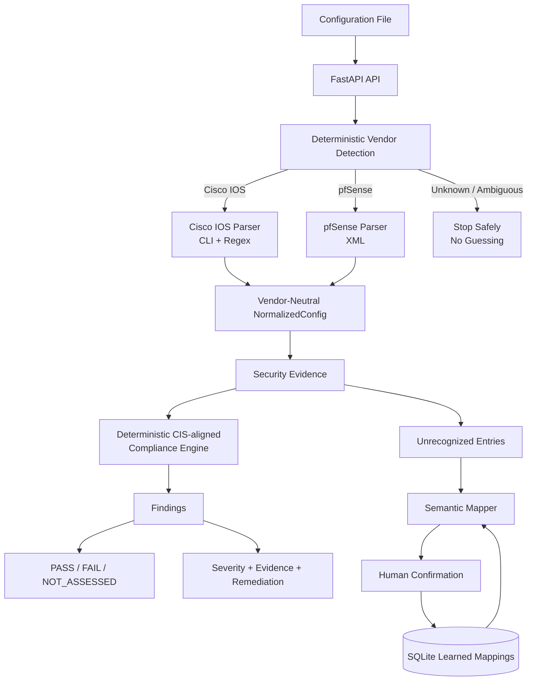
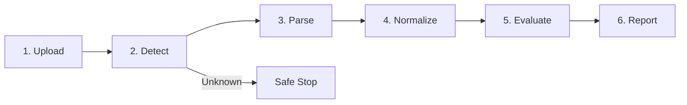
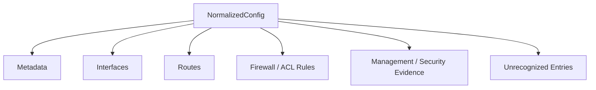
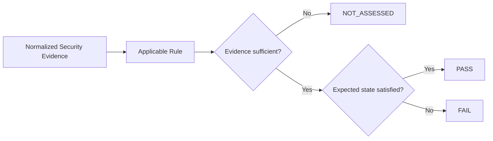
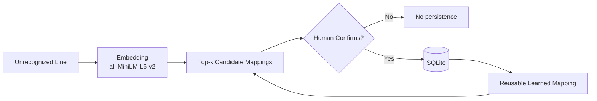
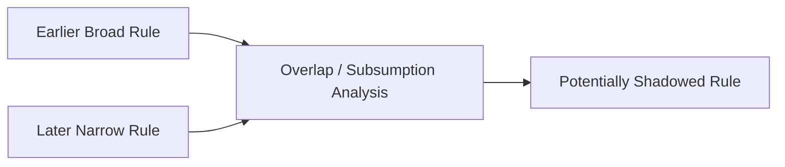

# SIH26155 - Network Security Compliance Auditor
## Architecture Document

| Item | Value |
|---|---|
| Problem Statement | **SIH26155 - Network Security Compliance Auditor** |
| Theme | **Blockchain & Cybersecurity** |
| Category | **Software** |
| Team | **TrailBlazers** |
| Architecture status | **Current merged MVP** |

---

## 1. System Objective

The Network Security Compliance Auditor converts a raw network-device configuration into an evidence-backed security assessment.

The current merged MVP supports **Cisco IOS** and **pfSense**. It detects the vendor, parses vendor-specific syntax into a vendor-neutral `NormalizedConfig`, evaluates applicable CIS-aligned security themes deterministically, preserves evidence, and exposes remediation guidance.

The system deliberately supports three compliance outcomes:

| Result | Meaning |
|---|---|
| **PASS** | Available evidence satisfies the expected state. |
| **FAIL** | Evidence contradicts the control, or the rule defines missing required configuration as a failure. |
| **NOT_ASSESSED** | Reliable evidence is insufficient, so the system does not invent an answer. |

---

## 2. High-Level System Architecture



### Architectural boundary

> **Parsers extract facts. The compliance engine decides status. The AI layer only assists semantic mapping.**

---

## 3. End-to-End Audit Pipeline



| Stage | Responsibility | Output |
|---|---|---|
| Upload | Validate single-file input and size/text constraints | Raw configuration |
| Detect | Score supported vendor signals | Vendor + confidence + signals |
| Parse | Apply vendor-specific syntax rules | Structured entities |
| Normalize | Map syntax into common Pydantic model | `NormalizedConfig` |
| Evaluate | Apply applicable deterministic rules | Findings |
| Report | Present evidence, severity and remediation | Audit result / report |

---

## 4. Normalized Data Model

The normalization layer prevents every compliance rule from becoming vendor-specific.



Core model entities include:

- `ConfigMetadata`
- `NetworkInterface`
- `Route`
- `FirewallRule`
- `ManagementSettings`
- `UnrecognizedEntry`
- `NormalizedConfig`

---

## 5. Deterministic Compliance Engine

The compliance layer uses a JSON rule catalog plus a Python evaluator.

The current merged MVP contains **20 internal CIS-aligned control themes**. IDs such as `CIS-NET-01` ... `CIS-NET-20` are application identifiers and should not be described as official CIS recommendation numbers unless an explicit benchmark mapping is maintained.



Every finding can contain:

`rule ID` -> `name` -> `status` -> `severity` -> `expected state` -> `evidence` -> `remediation`

---

## 6. AI-Assisted Semantic Learning

The learning system is advisory and human-in-the-loop.



| Property | Current behavior |
|---|---|
| Model | Sentence Transformers `all-MiniLM-L6-v2` |
| Candidate output | Ranked top-k mappings |
| Similarity score | Ranking signal, **not probability** |
| Persistence | Human confirmation required |
| Compliance authority | Deterministic engine |
| Unknown vendor assignment | Not performed by AI |

This prevents the model from silently turning an uncertain interpretation into a compliance decision.

---

## 7. Shadow Rule Detection

The merged implementation includes an ordered firewall / ACL analyzer.



Example:

```text
Rule 10  ALLOW  0.0.0.0/0  ->  10.0.0.0/24
Rule 20  DENY   10.0.0.50  ->  10.0.0.0/24
             ^
             |
      later rule may never match
```

The current feature is an MVP relationship analyzer for overlapping and ordered rules. It is not a claim of complete packet-processing equivalence for every vendor and feature.

---

## 8. Reporting and Evidence

The merged implementation includes a ReportLab-based PDF report generator.

The reporting layer is designed to consolidate:

| Report area | Contents |
|---|---|
| Metadata | Device / audit information |
| Summary | Pass, fail and not-assessed counts |
| Findings | Control, severity, status |
| Evidence | Observed configuration evidence |
| Remediation | Ready-to-copy guidance |
| Rule analysis | Shadow / ordering observations where available |

---

## 9. Security and Failure Behavior

| Boundary | Behavior |
|---|---|
| Unknown vendor | Never force-classified |
| Missing evidence | `NOT_ASSESSED` where appropriate |
| AI | Advisory only |
| Learning | Human confirmation required |
| Remediation | Recommendation only; no automatic execution |
| Similarity | Ranking signal, not probability |
| Vendor logic | Isolated in parser / normalization layers |

---

## 10. Technology Stack

| Layer | Technology |
|---|---|
| UI | React + Vite |
| API | FastAPI + Uvicorn |
| Data contracts | Pydantic |
| Cisco parsing | Python + Regex |
| pfSense parsing | Python XML parser |
| Compliance | JSON rule catalog + deterministic Python evaluator |
| Semantic learning | Sentence Transformers + `all-MiniLM-L6-v2` |
| Persistence | SQLite |
| Reporting | ReportLab |
| Testing | Pytest |

---

## 11. Current Scope and Deferred Work

### Current merged MVP

- Single-file audit
- Cisco IOS + pfSense
- Vendor detection
- Vendor-neutral normalization
- 20 CIS-aligned control themes
- `PASS / FAIL / NOT_ASSESSED`
- Evidence + severity + remediation
- `/api/audit`
- Semantic learning foundation
- Human-confirmed mappings
- Shadow-rule analysis
- PDF report generator

### Deferred

| Capability | Status |
|---|---|
| FortiGate | Deferred |
| NIST implementation | Deferred |
| Bulk inventory / batch uploads | Deferred |
| Live SSH | Deferred |
| Automatic remediation execution | Deferred |
| RBAC / authentication | Deferred |
| Chatbot | Deferred |
| Change-impact analysis | Deferred |
| Blockchain / tamper-evident ledger | Deferred |
| Continuous monitoring | Deferred |

> **Evaluation principle:** deterministic evidence first; AI assists mapping but does not decide compliance.
